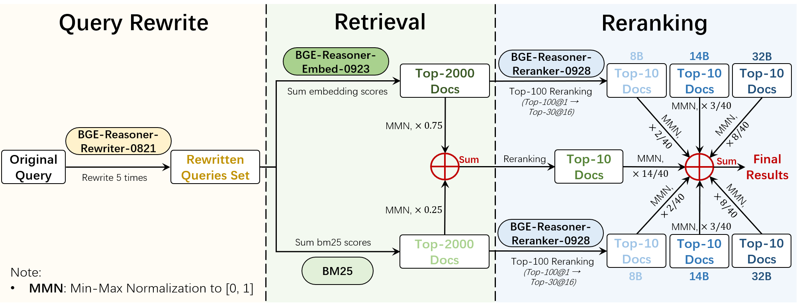
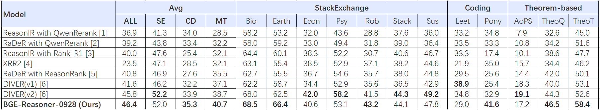
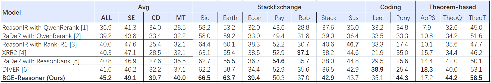

<div align="center">
<h1> BGE-Reasoner: Towards End-to-End Reasoning-Intensive Information Retrieval </h1>
</div>

## Introduction

We introduce **BGE-Reasoner**, an end-to-end reasoning-intensive information retrieval framework. BGE-Reasoner is characterized by three key features:

1. **End-to-end**: It comprises three core components in IR—**BGE-Reasoner-Rewriter**, **BGE-Reasoner-Embed**, and **BGE-Reasoner-Reranker**—covering the entire retrieval pipeline, from query rewriting and retrieval to reranking for reasoning-intensive tasks.
2. **Excellent performance**: **BGE-Reasoner** achieves **state-of-the-art (SOTA)** performance on [BRIGHT](https://brightbenchmark.github.io/), a reasoning-intensive information retrieval benchmark, with an **nDCG@10 of 46.4** across 12 datasets (BGE-Reasoner-0928, released on Oct 11, 2025), outperforming the previous SOTA by +0.6 points (45.8 from [DIVER](https://arxiv.org/pdf/2508.07995), Aug 27, 2025).
3. **Open-source resources**: We have fully released the related resources to facilitate future research on reasoning-intensive information retrieval.

## Open-source Resources

### Models

#### Rewriter

| Resource Type | Name                       | Link                                                         | Release Date | Comments                                                     |
| ------------- | -------------------------- | ------------------------------------------------------------ | ------------ | ------------------------------------------------------------ |
| Model         | BGE-Reasoner-Rewriter-0821 | 🤗[reasoner-rewriter-qwen2.5-7b-0821](https://huggingface.co/cfli/reasoner-rewriter-qwen2.5-7b-0821) | Oct 11, 2025 | fine-tuned on [Qwen/Qwen2.5-7B-Instruct](https://huggingface.co/Qwen/Qwen2.5-7B-Instruct) with BGE-Reasoner-Data-0904 |

#### Embedder

| Resource Type | Name                    | Link                                                         | Release Date | Comments                                                     |
| ------------- | ----------------------- | ------------------------------------------------------------ | ------------ | ------------------------------------------------------------ |
| Model         | BGE-Reasoner-Embed-0928 | 🤗[reason-embed-qwen3-8b-0928](https://huggingface.co/hanhainebula/reason-embed-qwen3-8b-0928) | Oct 11, 2025 | nDCG@10 = 38.1 on BRIGHT using original queries; fine-tuned on [Qwen/Qwen3-8B](https://huggingface.co/Qwen/Qwen3-8B) with BGE-Reasoner-Data-0928 using the novel RI-InfoNCE loss proposed in the [paper](https://arxiv.org/abs/2510.08252) |
| Model         | BGE-Reasoner-Embed-0923 | 🤗[reason-embed-basic-qwen3-8b-0928](https://huggingface.co/hanhainebula/reason-embed-basic-qwen3-8b-0928) (same as [bge-reasoner-embed-qwen3-8b-0923](https://huggingface.co/BAAI/bge-reasoner-embed-qwen3-8b-0923)) | Sep 23, 2025 | nDCG@10 = 37.1 on BRIGHT using original queries; fine-tuned on [Qwen/Qwen3-8B](https://huggingface.co/Qwen/Qwen3-8B) with BGE-Reasoner-Data-0928 using the basic InfoNCE loss |
| Model         | BGE-Reasoner-Embed-0821 | -                                                            | -            | nDCG@10 = 32.5 on BRIGHT using original queries; will not be released due to its suboptimal performance compared to BGE-Reasoner-Embed-0923 |

#### Reranker

| Resource Type | Name                           | Link                                                         | Release Date | Comments                                                     |
| ------------- | ------------------------------ | ------------------------------------------------------------ | ------------ | ------------------------------------------------------------ |
| Model         | BGE-Reasoner-Reranker-0928-8B  | 🤗[retro-star-qwen3-8b-0928](https://huggingface.co/ljw13/retro-star-qwen3-8b-0928) | Oct 11, 2025 | fine-tuned on [Qwen/Qwen3-8B](https://huggingface.co/Qwen/Qwen3-8B) with BGE-Reasoner-Data-0928 |
| Model         | BGE-Reasoner-Reranker-0928-14B | 🤗[retro-star-qwen3-14b-0928](https://huggingface.co/ljw13/retro-star-qwen3-14b-0928) | Oct 11, 2025 | fine-tuned on [Qwen/Qwen3-14B](https://huggingface.co/Qwen/Qwen3-14B) with BGE-Reasoner-Data-0928 |
| Model         | BGE-Reasoner-Reranker-0928-32B | 🤗[retro-star-qwen3-32b-0928](https://huggingface.co/ljw13/retro-star-qwen3-32b-0928) | Oct 11, 2025 | fine-tuned on [Qwen/Qwen3-32B](https://huggingface.co/Qwen/Qwen3-32B) with BGE-Reasoner-Data-0928 |
| Model         | BGE-Reasoner-Reranker-0821-\*   | -                                                            | -            | used in BGE-Reasoner-0821; will not be released due to their suboptimal performance compared to BGE-Reasoner-Reranker-0923-\* |

### Evaluation

#### Rewritten Query

| Resource Type   | Name                              | Link                                                         | Release Date | Comments |
| --------------- | --------------------------------- | ------------------------------------------------------------ | ------------ | -------- |
| Rewrriten Query | BGE-Reasoner-Rewritten-Query-0821 | 🤗[reasoner-rewritten-query-0821](https://huggingface.co/datasets/cfli/reasoner-rewritten-query-0821) | Oct 11, 2025 |          |

#### Search Results

| Resource Type  | Name                                                | Link                                                         | Release Date | Comments                                                     |
| -------------- | --------------------------------------------------- | ------------------------------------------------------------ | ------------ | ------------------------------------------------------------ |
| Search Results | search results of BGE-Reasoner-Embed-0821 on BRIGHT | [🤗](https://huggingface.co/datasets/hanhainebula/bright-search-results_bge-reasoner-embed-0821/tree/main) | Sep 4, 2025  | nDCG@10 = 32.5 using original query; submission to BRIGHT leaderboard on Aug 21, 2025 |
| Search Results | search results of BGE-Reasoner on BRIGHT            | [🤗](https://huggingface.co/datasets/hanhainebula/bright-search-results) | Oct 11, 2025 |                                                              |

#### Evaluation Scripts

| Resource Type      | Name                                                         | Link                                                         | Release Date | Comments                                |
| ------------------ | ------------------------------------------------------------ | ------------------------------------------------------------ | ------------ | --------------------------------------- |
| Evaluation Scripts | evaluation script of BGE-Reasoner-Embed-0923 on BRIGHT       | [script](https://github.com/VectorSpaceLab/agentic-search/blob/main/ReasonEmbed/evaluation_bright/scripts/ours/eval_reason_embed_basic_qwen3_8b.sh) | Oct 11, 2025 | using original query                    |
| Evaluation Scripts | evaluation script of BM25 on BRIGHT                          | [script](https://github.com/VectorSpaceLab/agentic-search/tree/main/ReasonRewriter#for-bm25) | Oct 11, 2025 | using BGE-Reasoner-Rewritten-Query-0821 |
| Evaluation Scripts | evaluation script of BGE-Reasoner-Embed-0923 on BRIGHT       | [script](https://github.com/VectorSpaceLab/agentic-search/tree/main/ReasonRewriter#for-other-models) | Oct 11, 2025 | using BGE-Reasoner-Rewritten-Query-0821 |
| Evaluation Scripts | evaluation script of BGE-Reasoner-Reranker-0928-\* based on the search results from BM25 using BGE-Reasoner-Rewritten-Query-0821 | [script](https://github.com/VectorSpaceLab/agentic-search/blob/main/Retro-star/evaluation/bright/scripts/reasoner-rewritten-query-0821/bm25/100%401-30%4016-retro-star-qwen3-8b-0928.sh) | Oct 11, 2025 | using original query                    |
| Evaluation Scripts | evaluation script of BGE-Reasoner-Reranker-0928-\* based on the search results from BGE-Reasoner-Embed-0923 using BGE-Reasoner-Rewritten-Query-0821 | [script](https://github.com/VectorSpaceLab/agentic-search/blob/main/Retro-star/evaluation/bright/scripts/reasoner-rewritten-query-0821/reason-embed-basic-qwen3-8b-0928/100%401-30%4016-retro-star-qwen3-8b-0928.sh) | Oct 11, 2025 | using original query                    |
| Evaluation Scripts | scripts for fusing all search results to obtain the final reranking results of BGE-Reasoner-0928 | [script](./fusion_results/scripts)                           | Oct 11, 2025 |                                         |

### Training

#### Data

| Resource Type | Name                   | Link                                                         | Release Date | Comments                                                     |
| ------------- | ---------------------- | ------------------------------------------------------------ | ------------ | ------------------------------------------------------------ |
| Training Data | BGE-Reasoner-Data-0904 | 🤗[bge-reasoner-data-0904](https://huggingface.co/datasets/hanhainebula/bge-reasoner-data/tree/main/bge-reasoner-data-0904) | Sep 4, 2025  | Used for training BGE-Reasoner-Rewriter-0821                 |
| Training Data | BGE-Reasoner-Data-0928 | 🤗[reason-embed-data-0928](https://huggingface.co/datasets/hanhainebula/reason-embed-data/tree/main/reason-embed-data-0928) | Oct 11, 2025 | Used for training BGE-Reasoner-Embed-0923, BGE-Reasoner-Reranker-0928-\* |

#### Code

For the training details of BGE-Reasoner-Embed, please refer to this page: [ReasonEmbed](https://github.com/VectorSpaceLab/agentic-search/tree/main/ReasonEmbed).

For the training details of BGE-Reasoner-Reranker, please refer to this page: [Retro-star](https://github.com/VectorSpaceLab/agentic-search/tree/main/Retro-star).


## BGE-Reasoner Pipeline

1. **Query Rewrite**: **BGE-Reasoner-Rewriter** generates 5 rewritten queries for each original query; all 5 rewrites are used for retrieval.
2. **Retrieval**: For each rewritten query, **BGE-Reasoner-Embed** and **BM25** retrieve the top-2000 documents. We aggregate results across the 5 rewrites by summing the corresponding scores to produce a final score per method.
3. **Reranking**:
    - We rerank the top-100 documents from each retrieval method using **BGE-Reasoner-Reranker** (models: 8B, 14B, 32B), producing 6 reranked top-10 lists (2 retrieval methods × 3 reranker sizes).
    - We also create a hybrid top-10 by fusing **BGE-Reasoner-Embed** and **BM25** (weights: 0.75 / 0.25 after min–max normalization).
    - Finally, we combine the 7 top-10 lists (6 reranked + 1 hybrid) to produce the final top-10.

## Performance

### BGE-Reasoner-0928 (nDCG@10 = 46.4, released on Oct 11, 2025)

Pipeline:



Results:



Note:
- "**Avg - ALL**" refers to the average performance across **all 12 datasets** in the BRIGHT benchmark.
- "**Avg - SE**" refers to the average performance across the **7 datasets in the StackExchange subset** of the BRIGHT benchmark.
- "**Avg - CD**" refers to the average performance across the **2 datasets in the Coding subset** of the BRIGHT benchmark.
- "**Avg - MT**" refers to the average performance across the **3 datasets in the Theorem-based subset** of the BRIGHT benchmark.

> Sources of results:
>
> [1] https://arxiv.org/pdf/2504.20595
>
> [2] https://github.com/Debrup-61/RaDeR
>
> [3] https://huggingface.co/ielabgroup/Rank-R1-32B-v0.2
>
> [4] https://github.com/jataware/XRR2
>
> [5] http://arxiv.org/pdf/2508.07050
>
> [6] https://arxiv.org/pdf/2508.07995

### BGE-Reasoner-0821 (nDCG@10 = 45.2, released on Aug 21, 2025)

Pipeline:


Results:



Note:
- "**Avg - ALL**" refers to the average performance across **all 12 datasets** in the BRIGHT benchmark.
- "**Avg - SE**" refers to the average performance across the **7 datasets in the StackExchange subset** of the BRIGHT benchmark.
- "**Avg - CD**" refers to the average performance across the **2 datasets in the Coding subset** of the BRIGHT benchmark.
- "**Avg - MT**" refers to the average performance across the **3 datasets in the Theorem-based subset** of the BRIGHT benchmark.

> Sources of results:
>
> [1] https://arxiv.org/pdf/2504.20595
>
> [2] https://github.com/Debrup-61/RaDeR
>
> [3] https://huggingface.co/ielabgroup/Rank-R1-32B-v0.2
>
> [4] https://github.com/jataware/XRR2
>
> [5] http://arxiv.org/pdf/2508.07050
>
> [6] https://arxiv.org/pdf/2508.07995


## Citation

If you find this repository useful, please consider giving a star ⭐ and citation:
```
@article{chen2025reasonembed,
  title={ReasonEmbed: Enhanced Text Embeddings for Reasoning-Intensive Document Retrieval},
  author={Chen, Jianlyu and Lan, Junwei and Li, Chaofan and Lian, Defu and Liu, Zheng},
  journal={arXiv preprint arXiv:2510.08252},
  year={2025}
}

@article{lan2025retro,
  title={Retro*: Optimizing LLMs for Reasoning-Intensive Document Retrieval},
  author={Lan, Junwei and Chen, Jianlyu and Liu, Zheng and Li, Chaofan and Bao, Siqi and Lian, Defu},
  journal={arXiv preprint arXiv:2509.24869},
  year={2025}
}
```
