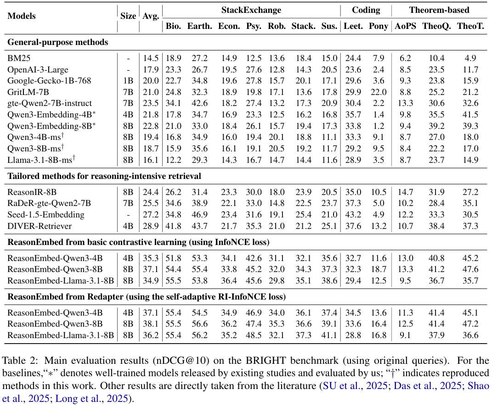
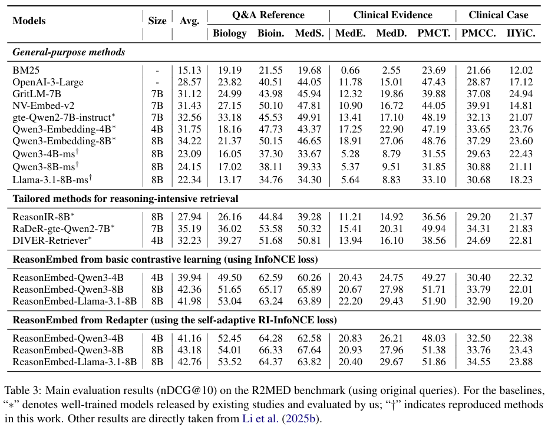

<div align="center">
<h1> ReasonEmbed: Enhanced Text Embeddings for Reasoning-Intensive Document Retrieval </h1>
</div>

<p align="center">
  <a href="https://arxiv.org/abs/2510.08252" target="_blank" rel="noopener noreferrer">
    
  </a>
  <a href="https://huggingface.co/collections/hanhainebula/reasonembed-68ea63ce4163e503690d4f2d"></a>
  <a href="https://huggingface.co/datasets/hanhainebula/reason-embed-data"></a>
</p>


## Introduction

We propose **ReasonEmbed**, a new text embedding model for reasoning-intensive document retrieval based on innovations of how synthetic data is generated and used. Our work includes the following technical contributions.
1. We design a novel data synthesis method, called **ReMixer**.
2. We introduce a self-adaptive training method tailored for our synthetic data, termed **Redapter**.
3. We implement ReasonEmbed based on multiple LLM backbones of varying model sizes, which achieve **state-of-the-art (SOTA) performance** on reasoning-intensive document retrieval tasks. Notably, our model built on Qwen3-4B reaches an nDCG@10 score of 37.1 on the [BRIGHT](https://brightbenchmark.github.io/) benchmark, which already surpasses all existing text embedding models. While the Qwen3-8B based varient improves the performance to 38.1. Moreover, on the [R2MED](https://r2med.github.io/) benchmark, ReasonEmbed-Qwen3-8B attains an nDCG@10 score of 43.18, surpassing all of the existing models by a large margin and leading to new SOTA performance.

For more details, please refer to our [paper](https://arxiv.org/pdf/2510.08252).

## Performance

### BRIGHT

Evaluation results of ReasonEmbed on the [BRIGHT](https://brightbenchmark.github.io/) benchmark:



### R2MED

Evaluation results of ReasonEmbed on the [R2MED](https://r2med.github.io/) benchmark:



## Open-Source Resources

### Models

#### Embedder

| Resource Type | Name                           | Link                                                         | Release Date | Comments                                                     |
| ------------- | ------------------------------ | ------------------------------------------------------------ | ------------ | ------------------------------------------------------------ |
| Model         | ReasonEmbed-Qwen3-8B           | 🤗[reason-embed-qwen3-8b-0928](https://huggingface.co/hanhainebula/reason-embed-qwen3-8b-0928) | Oct 11, 2025 | nDCG@10 = 38.1 on BRIGHT using original queries; fine-tuned on [Qwen/Qwen3-8B](https://huggingface.co/Qwen/Qwen3-8B) with our synthetic dataset using the novel RI-InfoNCE loss |
| Model         | ReasonEmbed-Basic-Qwen3-8B     | 🤗[reason-embed-basic-qwen3-8b-0928](https://huggingface.co/hanhainebula/reason-embed-basic-qwen3-8b-0928) | Oct 11, 2025 | nDCG@10 = 37.1 on BRIGHT using original queries; fine-tuned on [Qwen/Qwen3-8B](https://huggingface.co/Qwen/Qwen3-8B) with our synthetic dataset using the basic InfoNCE loss |
| Model         | ReasonEmbed-Qwen3-4B           | 🤗[reason-embed-qwen3-4b-0928](https://huggingface.co/hanhainebula/reason-embed-qwen3-4b-0928) | Oct 11, 2025 | nDCG@10 = 37.1 on BRIGHT using original queries; fine-tuned on [Qwen/Qwen3-4B](https://huggingface.co/Qwen/Qwen3-4B) with our synthetic dataset using the novel RI-InfoNCE loss |
| Model         | ReasonEmbed-Basic-Qwen3-4B     | 🤗[reason-embed-basic-qwen3-4b-0928](https://huggingface.co/hanhainebula/reason-embed-basic-qwen3-4b-0928) | Oct 11, 2025 | nDCG@10 = 35.3 on BRIGHT using original queries; fine-tuned on [Qwen/Qwen3-4B](https://huggingface.co/Qwen/Qwen3-4B) with our synthetic dataset using the basic InfoNCE loss |
| Model         | ReasonEmbed-Llama-3.1-8B       | 🤗[reason-embed-llama-3.1-8b-0928](https://huggingface.co/hanhainebula/reason-embed-llama-3.1-8b-0928) | Oct 11, 2025 | nDCG@10 = 36.2 on BRIGHT using original queries; fine-tuned on [meta-llama/Llama-3.1-8B](https://huggingface.co/meta-llama/Llama-3.1-8B) with our synthetic dataset using the novel RI-InfoNCE loss |
| Model         | ReasonEmbed-Basic-Llama-3.1-8B | 🤗[reason-embed-basic-llama-3.1-8b-0928](https://huggingface.co/hanhainebula/reason-embed-basic-llama-3.1-8b-0928) | Oct 11, 2025 | nDCG@10 = 34.9 on BRIGHT using original queries; fine-tuned on [meta-llama/Llama-3.1-8B](https://huggingface.co/meta-llama/Llama-3.1-8B) with our synthetic dataset using the basic InfoNCE loss |

#### Annotator

| Resource Type | Name                           | Link                                             | Release Date | Comments                                                     |
| ------------- | ------------------------------ | ------------------------------------------------ | ------------ | ------------------------------------------------------------ |
| Model         | ReasonEmbed-Annotator-Qwen3-8B | 🤗 (TBA) [reason-embed-annotator-qwen3-8b-0928]() | -            | Distilled relevance annotator based on [Qwen/Qwen3-8B](https://huggingface.co/Qwen/Qwen3-8B) used in our paper |

### Evaluation

#### Search Results

| Resource Type  | Name                                    | Link                                                         | Release Date | Comments |
| -------------- | --------------------------------------- | ------------------------------------------------------------ | ------------ | -------- |
| Search Results | search results of ReasonEmbed on BRIGHT | [🤗](https://huggingface.co/datasets/hanhainebula/bright-search-results) | Oct 11, 2025 |          |

#### Code and Evaluation Scripts

| Resource Type               | Name                                | Link                                                         | Release Date | Comments                                                     |
| --------------------------- | ----------------------------------- | ------------------------------------------------------------ | ------------ | ------------------------------------------------------------ |
| Evaluation Code and Scripts | BRIGHT evaluation code              | [code](https://github.com/FlagOpen/FlagEmbedding/tree/master/FlagEmbedding/evaluation/bright) & [scripts](https://github.com/VectorSpaceLab/agentic-search/tree/main/ReasonEmbed/evaluation_bright/scripts) | Oct 10, 2025 | integrated with [FlagEmbedding](https://github.com/FlagOpen/FlagEmbedding) |
| Evaluation Code and Scripts | evaluation script of BM25 on BRIGHT | [code](https://github.com/VectorSpaceLab/agentic-search/tree/main/ReasonEmbed/evaluation_r2med/code) & [scripts](https://github.com/VectorSpaceLab/agentic-search/tree/main/ReasonEmbed/evaluation_r2med/scripts) | Oct 10, 2025 | implemented using [FlagEmbedding](https://github.com/FlagOpen/FlagEmbedding) framework |

### Data and Synthesis Code

#### Data

| Resource Type | Name                  | Link                                                         | Release Date | Comments                                              |
| ------------- | --------------------- | ------------------------------------------------------------ | ------------ | ----------------------------------------------------- |
| Training Data | ReasonEmbed-Data-0928 | 🤗[reason-embed-data-0928](https://huggingface.co/datasets/hanhainebula/reason-embed-data/tree/main/reason-embed-data-0928) | Oct 11, 2025 | used for training all ReasonEmbed models in our paper |

#### Code and Scripts

| Resource Type                   | Name    | Link  | Release Date | Comments       |
| ------------------------------- | ------- | ----- | ------------ | -------------- |
| Data Synthesis Code and Scripts | ReMixer | (TBA) | -            | to be released |

### Training Code

| Resource Type             | Name     | Link  | Release Date | Comments       |
| ------------------------- | -------- | ----- | ------------ | -------------- |
| Training Code and Scripts | Redapter | (TBA) | -            | to be released |

## Citation

If you find this repository useful, please consider giving a star ⭐ and citation:
```
@article{chen2025reasonembed,
  title={ReasonEmbed: Enhanced Text Embeddings for Reasoning-Intensive Document Retrieval},
  author={Chen, Jianlyu and Lan, Junwei and Li, Chaofan and Lian, Defu and Liu, Zheng},
  journal={arXiv preprint arXiv:2510.08252},
  year={2025}
}
```
