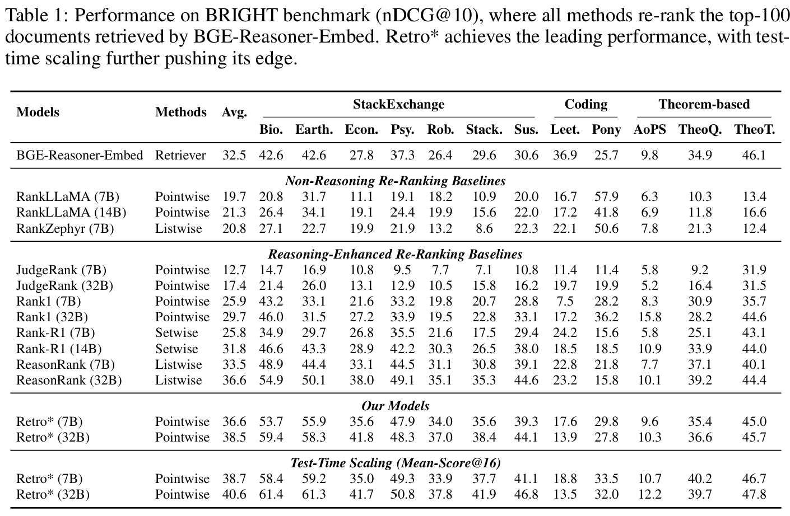
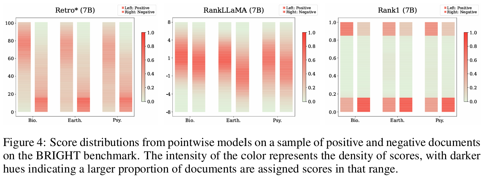

<div align="center">
<h1> Retro*: Optimizing LLMs for Reasoning-Intensive Document Retrieval </h1>
</div>

<p align="center">
  <a href="https://arxiv.org/abs/2509.24869" target="_blank" rel="noopener noreferrer">
    
  </a>
</p>

## Introduction

We propose **Retro\* (Retro-Star)**, a novel approach for reasoning-intensive document retrieval. Retro\* introduces a **rubric-based relevance scoring** mechanism, enabling the model to reason about the relationship between a task and a document based on explicitly defined criteria, whereby producing a fine-grained, interpretable relevance score. Retro\* also supports **test time scaling** by combining multiple reasoning trajectories via score integration, which produces more reliable relevance estimates.

To optimize Retro\*'s reasoning capabilities, we introduce a novel **reinforcement learning** algorithm tailored for its relevance scoring mechanism, which employs two composite rewards to fully exploit the trajectories of each training sample.

For more details, please refer to our [paper](https://arxiv.org/pdf/2509.24869).

## Performance

### BRIGHT

Evaluation results of Retro* (retro-star-qwen2.5-7b-instruct-0923, retro-star-qwen2.5-32b-instruct-0923) on the [BRIGHT](https://brightbenchmark.github.io/) benchmark:




## Open-Source Resources

### Training Datasets

| Name                  | Release Date | Comments |
| --------------------- | ------------ | ------------ |
| 🤗[BRIGHT](https://huggingface.co/datasets/ljw13/retro-star-training-datasets)   | Oct 16, 2025    | From 🤗[hanhainebula/bge-reasoner-data](https://huggingface.co/datasets/hanhainebula/bge-reasoner-data) |


### Model Checkpoints

| Name                  | Release Date |
| --------------------- | ------------ |
| 🤗[retro-star-qwen2.5-7b-instruct-0923](https://huggingface.co/ljw13/retro-star-qwen2.5-7b-instruct-0923)    | Oct 12, 2025    |
| 🤗[retro-star-qwen2.5-32b-instruct-0923](https://huggingface.co/ljw13/retro-star-qwen2.5-32b-instruct-0923)   | Oct 12, 2025    |
| 🤗[retro-star-qwen3-8b-0928](https://huggingface.co/ljw13/retro-star-qwen3-8b-0928)    | Oct 11, 2025    |
| 🤗[retro-star-qwen3-14b-0928](https://huggingface.co/ljw13/retro-star-qwen3-14b-0928)   | Oct 11, 2025    |
| 🤗[retro-star-qwen3-32b-0928](https://huggingface.co/ljw13/retro-star-qwen3-32b-0928)   | Oct 11, 2025    |

### Evaluation Codes and Scripts

For evaluation on the BRIGHT benchmark, please refer to the directory [evaluation/bright](./evaluation/bright/).

## Citation

If you find this repository useful, please consider giving a star ⭐ and citation:
```
@article{lan2025retro,
  title={Retro*: Optimizing LLMs for Reasoning-Intensive Document Retrieval},
  author={Lan, Junwei and Chen, Jianlyu and Liu, Zheng and Li, Chaofan and Bao, Siqi and Lian, Defu},
  journal={arXiv preprint arXiv:2509.24869},
  year={2025}
}
```
